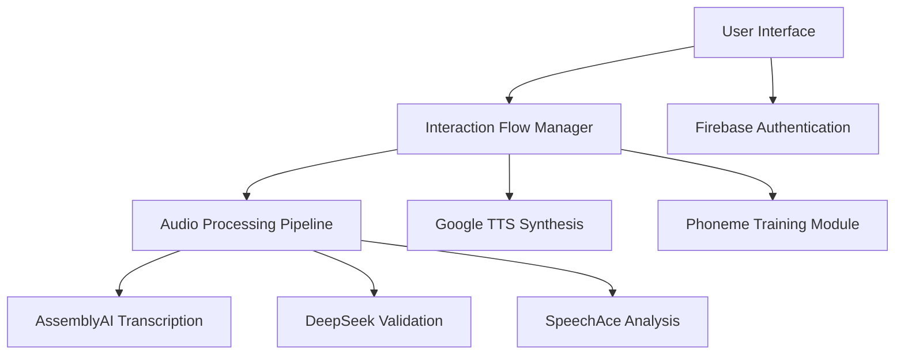
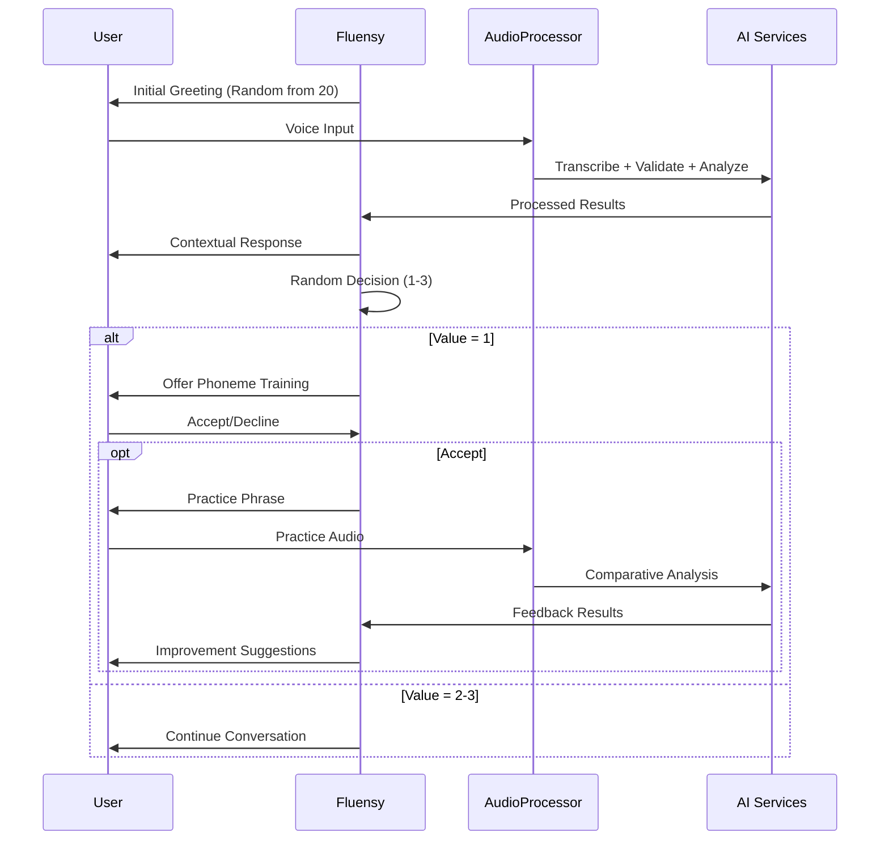

# Fluensy - AI-Powered Language Learning Platform

Fluensy is an interactive language learning application that uses advanced AI to help users improve their pronunciation through conversation with a friendly penguin companion. The app features real-time speech analysis, pronunciation feedback, and interactive phoneme training.

## 📋 Table of Contents

1. [🎯 Overview](#-overview)
2. [🚀 Getting Started](#-getting-started)
3. [🏗️ Architecture](#️-architecture)
4. [🎮 Features](#-features)
5. [🔧 Installation & Setup](#-installation--setup)
6. [📁 Project Structure](#-project-structure)
7. [🤖 AI Services Integration](#-ai-services-integration)
8. [🎵 Audio Processing System](#-audio-processing-system)
9. [🌍 Multi-Language Support](#-multi-language-support)
10. [💻 Implementation Details](#-implementation-details)
11. [🎪 Interaction Flow](#-interaction-flow)
12. [🎨 UI Components](#-ui-components)
13. [⚙️ Environment Configuration](#️-environment-configuration)
14. [🧪 API Routes](#-api-routes)
15. [📱 Pages & Navigation](#-pages--navigation)
16. [🛠️ Development](#️-development)
17. [🚢 Deployment](#-deployment)
18. [🔍 Troubleshooting](#-troubleshooting)

---

## 🎯 Overview

Fluensy combines multiple AI services to create an immersive language learning experience:

- **Conversational AI**: Interactive conversations with a penguin companion using DeepSeek AI
- **Speech Recognition**: Real-time transcription via AssemblyAI
- **Pronunciation Analysis**: Detailed feedback through SpeechAce API
- **Text-to-Speech**: Natural voice synthesis using Google Cloud TTS
- **Adaptive Learning**: Personalized phoneme training based on pronunciation analysis

### Key Technologies

- **Frontend**: Next.js 14, React, TypeScript, Tailwind CSS
- **Backend**: Next.js API Routes, Firebase Authentication
- **AI Services**: AssemblyAI, DeepSeek (via Together AI), SpeechAce, Google TTS
- **Audio Processing**: Web Audio API, MediaRecorder API
- **Database**: Firebase (Authentication & User Management)

---

## 🚀 Getting Started

### Prerequisites

- Node.js 18+ and npm/yarn
- Modern web browser with MediaRecorder support
- API keys for: AssemblyAI, Together AI, SpeechAce, Google Cloud TTS, Firebase

### Quick Start

```bash
# Clone the repository
git clone https://github.com/yourusername/fluensy-app.git
cd fluensy-app

# Install dependencies
npm install

# Set up environment variables (see Environment Configuration section)
cp .env.example .env.local

# Run development server
npm run dev
```

Open [http://localhost:3000](http://localhost:3000) to view the application.

---

## 🏗️ Architecture

### System Overview



### Core Components

1. **Interaction Flow Manager**: Orchestrates the entire conversation flow
2. **Audio Processor**: Handles recording, segmentation, and AI processing
3. **Service Layer**: Integrates with external AI APIs
4. **UI Components**: React components for user interaction
5. **State Management**: React Context for language and authentication

---

## 🎮 Features

### ✅ Complete Features

#### **Interactive Conversation Flow**

- **Initial Greeting**: 20 predefined greetings in English/Spanish with random selection
- **User Input Processing**: Voice → Transcription → Validation → Analysis pipeline
- **Follow-up Responses**: Contextual AI-generated responses with mood-based TTS
- **Decision Logic**: Random phoneme training opportunities or conversation continuation

#### **Phoneme Training Module**

- **Targeted Practice**: Identifies pronunciation difficulties from SpeechAce data
- **Interactive Choices**: User can choose phoneme training or continue conversation
- **Practice Phrases**: AI-generated examples with target phoneme emphasis
- **Feedback System**: Comparative analysis with improvement suggestions

#### **Advanced Audio Processing**

- **Smart Segmentation**: Automatic audio splitting at natural speech pauses
- **Real-time Processing**: Concurrent segment processing for optimal performance
- **Silence Detection**: Web Audio API-based pause detection
- **Background Analysis**: SpeechAce runs silently without blocking UI

#### **Multi-Language Support**

- **Bilingual**: English (en-US) and Spanish (es-ES) support
- **Automatic Configuration**: All AI services adapt to selected language
- **Dialect-Aware**: Region-specific pronunciation analysis
- **User Preferences**: Persistent language selection via localStorage

#### **User Management**

- **Firebase Authentication**: Email/password and Google sign-in
- **Profile Completion**: Required name and birthdate collection
- **Route Protection**: Authenticated and non-authenticated route guards
- **User Profiles**: Progress tracking and settings management

### 🎨 User Experience Features

- **Responsive Design**: Mobile-first design with Tailwind CSS
- **Animated Feedback**: Visual indicators for recording, processing, and playback
- **Speech Bubbles**: Dynamic conversation display with TTS synchronization
- **Progress Tracking**: User level, phoneme mastery, and exercise completion
- **Settings Management**: Language preferences, profile editing, theme options

---

## 🔧 Installation & Setup

### 1. Dependencies Installation

```bash
npm install
# or
yarn install
```

### 2. Environment Configuration

Create `.env.local` file with the following variables:

```bash
# Firebase Configuration
NEXT_PUBLIC_FIREBASE_API_KEY=your_firebase_api_key
NEXT_PUBLIC_FIREBASE_AUTH_DOMAIN=your_project.firebaseapp.com
NEXT_PUBLIC_FIREBASE_PROJECT_ID=your_project_id
NEXT_PUBLIC_FIREBASE_STORAGE_BUCKET=your_project.appspot.com
NEXT_PUBLIC_FIREBASE_MESSAGING_SENDER_ID=your_sender_id
NEXT_PUBLIC_FIREBASE_APP_ID=your_app_id

# AI Services API Keys
NEXT_PUBLIC_ASSEMBLYAI_API_KEY=your_assemblyai_key
NEXT_PUBLIC_TOGETHER_API_KEY=your_together_ai_key
NEXT_PUBLIC_SPEECHACE_API_KEY=your_speechace_key
NEXT_PUBLIC_SPEECHACE_USER_ID=your_speechace_user_id
NEXT_PUBLIC_GOOGLE_TTS_API_KEY=your_google_tts_key

# Language Configuration
NEXT_PUBLIC_DEFAULT_LANGUAGE=en
NEXT_PUBLIC_SUPPORTED_LANGUAGES=en,es
NEXT_PUBLIC_SPEECHACE_API_URL=https://api.speechace.co/api/scoring/text/v9/json

# Audio Processing Configuration
NEXT_PUBLIC_SILENCE_THRESHOLD=0.01
NEXT_PUBLIC_SILENCE_DELAY=1000
NEXT_PUBLIC_MAX_SEGMENT_DURATION=12000
NEXT_PUBLIC_MAX_TOTAL_DURATION=60000
```

### 3. Firebase Setup

1. Create a Firebase project at [Firebase Console](https://console.firebase.google.com)
2. Enable Authentication with Email/Password and Google providers
3. Copy your Firebase configuration to `.env.local`

### 4. API Keys Setup

#### AssemblyAI

- Sign up at [AssemblyAI](https://www.assemblyai.com/)
- Copy your API key from the dashboard

#### Together AI (for DeepSeek)

- Sign up at [Together AI](https://together.ai/)
- Generate an API key for DeepSeek model access

#### SpeechAce

- Sign up at [SpeechAce](https://www.speechace.co/)
- Get your API key and user ID from the dashboard

#### Google Cloud TTS

- Set up a Google Cloud project
- Enable the Text-to-Speech API
- Create a service account and download credentials
- Use the API key in your environment variables

---

## 📁 Project Structure

```
fluensy-app/
├── src/
│   ├── app/                          # Next.js 14 App Router
│   │   ├── page.tsx                  # Main conversation page
│   │   ├── layout.tsx                # Root layout with providers
│   │   ├── globals.css               # Global styles
│   │   ├── login/page.tsx            # Authentication pages
│   │   ├── signup/page.tsx
│   │   ├── complete-profile/page.tsx
│   │   ├── profile/page.tsx          # User profile management
│   │   ├── exercise/page.tsx         # Pronunciation exercises
│   │   └── api/                      # API routes
│   │       ├── assemblyai/route.ts
│   │       ├── google-tts/route.ts
│   │       └── speechace/route.ts
│   ├── components/                   # Reusable React components
│   │   ├── ui/                       # Base UI components
│   │   ├── MicrophoneButton.tsx      # Audio recording component
│   │   ├── PhonemeTraining.tsx       # Phoneme practice interface
│   │   ├── InteractionDecision.tsx   # Training choice component
│   │   ├── TranscriptionDisplay.tsx  # Results display
│   │   ├── BottomNavigation.tsx      # Mobile navigation
│   │   ├── client-layout.tsx         # Client-side layout wrapper
│   │   ├── route-protection.tsx      # Authentication guards
│   │   ├── login-form.tsx            # Authentication forms
│   │   ├── signup-form.tsx
│   │   ├── settings-menu.tsx         # User settings interface
│   │   ├── edit-profile-menu.tsx
│   │   └── language-settings.tsx     # Language selection
│   ├── contexts/                     # React Context providers
│   │   ├── AuthContext.tsx           # Authentication state
│   │   └── LanguageContext.tsx       # Language preferences
│   ├── lib/                          # Utility libraries
│   │   ├── services/                 # AI service integrations
│   │   │   ├── interaction-flow-manager.ts  # Main orchestrator
│   │   │   ├── audio-processor.ts    # Audio processing pipeline
│   │   │   ├── assemblyai.ts         # Speech transcription
│   │   │   ├── deepseek.ts           # AI conversation & validation
│   │   │   ├── speechace.ts          # Pronunciation analysis
│   │   │   ├── google-tts.ts         # Text-to-speech synthesis
│   │   │   ├── silence-detector.ts   # Audio silence detection
│   │   │   ├── conversation-manager.ts # Conversation state
│   │   │   ├── grading-system.ts     # Pronunciation scoring
│   │   │   └── browser-tts.ts        # Browser TTS fallback
│   │   ├── hooks/                    # Custom React hooks
│   │   │   └── useDebounce.ts
│   │   └── utils.ts                  # Utility functions
│   ├── firebase.ts                   # Firebase configuration
│   └── middleware.ts                 # Next.js middleware for auth
├── public/                           # Static assets
│   ├── penguin.svg                   # Mascot illustration
│   └── *.svg                         # UI icons
├── components.json                   # Shadcn/ui configuration
├── tailwind.config.ts                # Tailwind CSS configuration
├── tsconfig.json                     # TypeScript configuration
├── next.config.ts                    # Next.js configuration
└── package.json                      # Dependencies and scripts
```

---

## 🤖 AI Services Integration

### 1. AssemblyAI - Speech Recognition

**Purpose**: Converts audio to text with high accuracy
**Features**:

- Real-time transcription
- Language-specific models (English/Spanish)
- Automatic punctuation and formatting
- Speaker diarization support

**Configuration**:

```typescript
const config = {
  speech_model: "best",
  language_code: "en" | "es",
  punctuate: true,
  format_text: true,
};
```

### 2. DeepSeek AI - Conversation & Validation

**Purpose**: Provides conversational AI and transcription validation
**Features**:

- Context-aware responses with emotional understanding
- Transcription error correction
- Mood detection for appropriate TTS voice selection
- Bilingual conversation support

**Models Used**:

- `deepseek-chat` for conversation generation
- Language-specific prompts for validation

### 3. SpeechAce - Pronunciation Analysis

**Purpose**: Professional pronunciation scoring and phoneme analysis
**Features**:

- Word-level and phoneme-level scoring
- Proficiency level assessment (CEFR, IELTS, TOEIC)
- Detailed feedback with improvement suggestions
- Dialect-aware analysis (en-us, es-es)

**Scoring Metrics**:

- Overall pronunciation score (0-100)
- Individual phoneme accuracy
- Fluency and rhythm analysis
- Stress pattern detection

### 4. Google Cloud Text-to-Speech

**Purpose**: High-quality voice synthesis for AI responses
**Features**:

- Natural-sounding voices with emotion
- Language and dialect selection
- Mood-based voice selection
- SSML support for enhanced expression

**Voice Configuration**:

```typescript
{
  languageCode: "en-US" | "es-ES",
  name: voiceMapping[mood][language],
  ssmlGender: "FEMALE" | "MALE"
}
```

---

## 🎵 Audio Processing System

### Processing Pipeline

1. **Recording**: MediaRecorder captures audio in WebM format
2. **Segmentation**: SilenceDetector splits audio at natural pauses
3. **Transcription**: Each segment sent to AssemblyAI
4. **Validation**: DeepSeek corrects transcription errors
5. **Analysis**: SpeechAce provides pronunciation feedback
6. **Combination**: Results merged into final output

### Smart Segmentation Features

- **Silence Detection**: Web Audio API monitors volume levels
- **Automatic Splitting**: Audio divided at natural speech breaks
- **Fallback Timeouts**: 12-second segment limit, 60-second total
- **Concurrent Processing**: Segments processed immediately after recording

### Configuration Options

```typescript
interface AudioConfig {
  silenceThreshold: number; // Volume threshold for silence (0.01)
  silenceDelay: number; // Delay before considering silence (1000ms)
  maxSegmentDuration: number; // Maximum segment length (12000ms)
  maxTotalDuration: number; // Total recording limit (60000ms)
  language: "en" | "es"; // Processing language
}
```

### Performance Optimizations

- **Background Processing**: SpeechAce analysis runs silently
- **Memory Management**: Automatic audio blob cleanup
- **Error Recovery**: Graceful fallbacks for API failures
- **Resource Monitoring**: Browser compatibility checking

---

## 🌍 Multi-Language Support

### Supported Languages

| Language | Code | Dialect | TTS Voices | Status    |
| -------- | ---- | ------- | ---------- | --------- |
| English  | en   | en-us   | Multiple   | ✅ Active |
| Spanish  | es   | es-es   | Multiple   | ✅ Active |

### Language Context Implementation

```typescript
interface LanguageConfig {
  language: "en" | "es";
  displayName: string;
  assemblyAICode: string;
  speechAceDialect: string;
  ttsLanguageCode: string;
}
```

### Automatic Service Configuration

All AI services automatically adapt to the selected language:

- **AssemblyAI**: Uses language-specific transcription models
- **DeepSeek**: Applies language-appropriate prompts and responses
- **SpeechAce**: Configures dialect-specific pronunciation analysis
- **Google TTS**: Selects appropriate voices and language codes

### User Language Selection

Users can switch languages through:

1. Profile → Settings → Language Settings
2. Automatic detection based on browser locale
3. Persistent storage in localStorage
4. Context propagation throughout the application

---

## 💻 Implementation Details

### Interaction Flow Architecture

The application follows a structured 4-step interaction flow:

#### 1. Initial Greeting Sequence ✅

- **20 predefined greetings** per language with random selection
- **Google TTS integration** for audio generation
- **2-second delay** before playback as specified
- **Speech bubble synchronization** with TTS audio

#### 2. User Input Processing ✅

- **Complete pipeline**: Voice → AssemblyAI → DeepSeek → SpeechAce
- **Audio segment aggregation** into full transcription
- **SpeechAce data aggregation** into combined JSON
- **Real-time processing** with visual feedback

#### 3. Follow-up Agent Response ✅

- **Full transcription sent to DeepSeek** for context awareness
- **Contextual response generation** with emotional understanding
- **Mood-based TTS conversion** with appropriate voice selection
- **Automatic audio playback** with speech bubble display

#### 4. Post-Response Interaction Logic ✅

- **Random decision generation (1-3)** for interaction variety
- **Value 1**: Triggers phoneme training opportunity
- **Values 2-3**: Continue conversation with follow-up questions
- **Pronunciation analysis integration** for training recommendations

### State Management

```typescript
type AppState =
  | "waiting_for_penguin_click"
  | "initializing"
  | "greeting"
  | "waiting_for_user"
  | "processing_input"
  | "agent_responding"
  | "interaction_decision"
  | "phoneme_training"
  | "phoneme_feedback";
```

### Error Handling Strategy

- **Graceful Degradation**: Features continue working if individual services fail
- **User-Friendly Messages**: Clear error communication without technical jargon
- **Retry Mechanisms**: Automatic retry for transient failures
- **Fallback Options**: Browser TTS when Google TTS unavailable

---

## 🎪 Interaction Flow

### Complete Flow Sequence



### Phoneme Training Module

**Trigger Conditions**:

- Random value = 1 (33% chance)
- User has pronunciation data available
- Lowest-scoring word identified from SpeechAce results

**Training Process**:

1. **Identification**: Extract word/phoneme with poor performance
2. **Prompt**: "I noticed you had trouble with [word]. Would you like to practice?"
3. **Choice**: User selects "Yes, practice" or "No, continue"
4. **Practice**: AI provides example phrase with target phoneme
5. **Recording**: User attempts pronunciation
6. **Analysis**: Comparative scoring against AI example
7. **Feedback**: Specific improvement suggestions

### Decision Tree Logic

```typescript
const determineNextInteraction = async (): Promise<InteractionDecision> => {
  const randomValue = Math.floor(Math.random() * 3) + 1;

  if (randomValue === 1 && hasPronunciationData) {
    return {
      shouldOfferPhonemeTraining: true,
      phonemeSession: await generatePhonemeSession(),
    };
  }

  return {
    shouldOfferPhonemeTraining: false,
    followUpQuestions: await generateFollowUpQuestions(),
  };
};
```

---

## 🎨 UI Components

### Core Components

#### **MicrophoneButton**

- **Features**: Recording state management, visual feedback, timer display
- **Modes**: Free speech (transcription) and exercise (fixed ground truth)
- **Integration**: AudioProcessor for advanced processing pipeline

```tsx
<MicrophoneButton
  onTranscriptionStart={handleStart}
  onTranscriptionComplete={handleComplete}
  groundTruthMode="fixed" // or "transcription"
  fixedGroundTruth="Practice phrase"
  isWaitingForUser={true}
  isExternallyProcessing={false}
/>
```

#### **PhonemeTraining**

- **Features**: Interactive pronunciation practice with TTS examples
- **Feedback**: Real-time scoring and improvement suggestions
- **Progress**: Visual indicators for practice completion

#### **InteractionDecision**

- **Purpose**: Present choice between phoneme training and conversation
- **Design**: Clear buttons with explanatory text
- **Integration**: Seamless flow transition

#### **TranscriptionDisplay**

- **Features**: Results display with loading states and audio playback
- **Modes**: Configurable visibility for user transcription
- **Polish**: Professional appearance with processing indicators

### UI/UX Features

- **Mobile-First Design**: Responsive layout optimized for mobile devices
- **Animated Feedback**: Smooth transitions and visual state indicators
- **Accessibility**: Screen reader support and keyboard navigation
- **Loading States**: Clear progress indicators during processing
- **Error States**: User-friendly error messages with recovery options

---

## ⚙️ Environment Configuration

### Required API Keys

```bash
# Firebase Authentication
NEXT_PUBLIC_FIREBASE_API_KEY=
NEXT_PUBLIC_FIREBASE_AUTH_DOMAIN=
NEXT_PUBLIC_FIREBASE_PROJECT_ID=
NEXT_PUBLIC_FIREBASE_STORAGE_BUCKET=
NEXT_PUBLIC_FIREBASE_MESSAGING_SENDER_ID=
NEXT_PUBLIC_FIREBASE_APP_ID=

# AI Services
NEXT_PUBLIC_ASSEMBLYAI_API_KEY=
NEXT_PUBLIC_TOGETHER_API_KEY=
NEXT_PUBLIC_SPEECHACE_API_KEY=
NEXT_PUBLIC_SPEECHACE_USER_ID=
NEXT_PUBLIC_GOOGLE_TTS_API_KEY=

# Application Configuration
NEXT_PUBLIC_DEFAULT_LANGUAGE=en
NEXT_PUBLIC_SUPPORTED_LANGUAGES=en,es
NEXT_PUBLIC_SPEECHACE_API_URL=https://api.speechace.co/api/scoring/text/v9/json

# Audio Processing Tuning
NEXT_PUBLIC_SILENCE_THRESHOLD=0.01
NEXT_PUBLIC_SILENCE_DELAY=1000
NEXT_PUBLIC_MAX_SEGMENT_DURATION=12000
NEXT_PUBLIC_MAX_TOTAL_DURATION=60000
```

### Service URLs and Endpoints

- **AssemblyAI**: `https://api.assemblyai.com/v2/`
- **Together AI**: `https://api.together.xyz/v1/`
- **SpeechAce**: `https://api.speechace.co/api/scoring/text/v9/json`
- **Google TTS**: `https://texttospeech.googleapis.com/v1/text:synthesize`

---

## 🧪 API Routes

### `/api/assemblyai`

**Purpose**: Transcription service proxy
**Methods**: POST
**Input**: Audio blob, language configuration
**Output**: Transcribed text with timestamps

### `/api/google-tts`

**Purpose**: Text-to-speech synthesis
**Methods**: POST
**Input**: Text, language, voice name
**Output**: Base64-encoded MP3 audio

### `/api/speechace`

**Purpose**: Pronunciation analysis
**Methods**: POST
**Input**: Audio file, reference text, dialect
**Output**: Detailed pronunciation scores and feedback

### Error Handling

All API routes implement:

- **Input validation** with detailed error messages
- **Rate limiting** to prevent abuse
- **CORS configuration** for cross-origin requests
- **Comprehensive logging** for debugging

---

## 📱 Pages & Navigation

### Page Structure

#### **Homepage (`/`)**

- **Purpose**: Main conversation interface with Fluensy
- **Features**: Interactive chat, phoneme training, audio playback
- **Authentication**: Required

#### **Login (`/login`)**

- **Purpose**: User authentication
- **Features**: Email/password and Google sign-in
- **Authentication**: Redirects if already logged in

#### **Signup (`/signup`)**

- **Purpose**: User registration
- **Features**: Account creation with validation
- **Flow**: Redirects to profile completion

#### **Complete Profile (`/complete-profile`)**

- **Purpose**: Required profile information collection
- **Features**: Name and birthdate input with validation
- **Authentication**: Required, one-time completion

#### **Profile (`/profile`)**

- **Purpose**: User profile management and progress tracking
- **Features**: Settings access, progress display, achievements
- **Authentication**: Required

#### **Exercise (`/exercise`)**

- **Purpose**: Structured pronunciation practice
- **Features**: Fixed-phrase exercises with detailed feedback
- **Authentication**: Required

### Navigation System

#### **Bottom Navigation**

- **Exercise**: Pronunciation practice page
- **Home**: Main conversation interface
- **Profile**: User management and settings

#### **Route Protection**

- **Authenticated Routes**: Redirect to login if not signed in
- **Public Routes**: Login and signup pages
- **Conditional Navigation**: Hide bottom nav on auth pages

---

## 🛠️ Development

### Available Scripts

```bash
# Development server
npm run dev

# Production build
npm run build

# Start production server
npm start

# Type checking
npm run type-check

# Linting
npm run lint

# Fix linting issues
npm run lint:fix
```

### Development Workflow

1. **Feature Development**:

   - Create feature branch from `main`
   - Implement feature with TypeScript
   - Add appropriate error handling
   - Test with all AI services

2. **Testing Strategy**:

   - **Unit Tests**: Individual service functions
   - **Integration Tests**: API route functionality
   - **User Testing**: Complete interaction flows
   - **Cross-browser**: MediaRecorder compatibility

3. **Code Standards**:
   - **TypeScript**: Strict type checking enabled
   - **ESLint**: Automated code quality checks
   - **Prettier**: Consistent code formatting
   - **Conventional Commits**: Standardized commit messages

### Debugging Features

- **Console Logging**: Structured logging for development
- **Error Boundaries**: React error catching and reporting
- **Service Validation**: API connectivity testing utilities
- **Audio Debugging**: Visual feedback for audio processing states

---

## 🚢 Deployment

### Production Deployment

#### **Environment Setup**

1. Set up production Firebase project
2. Configure all API keys in production environment
3. Update CORS settings for production domain
4. Enable analytics and monitoring

#### **Vercel Deployment** (Recommended)

```bash
# Install Vercel CLI
npm i -g vercel

# Deploy to Vercel
vercel --prod

# Set environment variables
vercel env add NEXT_PUBLIC_FIREBASE_API_KEY
# ... (repeat for all environment variables)
```

#### **Manual Deployment**

```bash
# Build for production
npm run build

# Export static files (if needed)
npm run export

# Deploy build folder to hosting service
```

### Performance Optimization

- **Image Optimization**: Next.js automatic image optimization
- **Code Splitting**: Automatic route-based splitting
- **API Route Caching**: Appropriate cache headers
- **CDN Integration**: Static asset delivery optimization

### Monitoring & Analytics

- **Error Tracking**: Console error logging and reporting
- **Performance Monitoring**: Core Web Vitals tracking
- **User Analytics**: Firebase Analytics integration
- **API Usage**: Monitor service usage and costs

---

## 🔍 Troubleshooting

### Common Issues

#### **Audio Recording Problems**

- **Issue**: Microphone not working
- **Solution**: Check browser permissions, HTTPS requirement
- **Debug**: Test with `navigator.mediaDevices.getUserMedia()`

#### **API Service Errors**

- **Issue**: Transcription or TTS failing
- **Solution**: Verify API keys, check network connectivity
- **Debug**: Monitor browser network tab for failed requests

#### **Authentication Issues**

- **Issue**: Login not working
- **Solution**: Check Firebase configuration, clear browser cache
- **Debug**: Verify Firebase project settings

#### **Performance Issues**

- **Issue**: Slow processing or audio delays
- **Solution**: Check audio configuration, reduce segment duration
- **Debug**: Monitor console for processing times

### Debug Tools

#### **Console Commands**

```javascript
// Check audio support
navigator.mediaDevices.enumerateDevices();

// Test API connectivity
fetch("/api/google-tts", {
  method: "POST",
  body: JSON.stringify({ text: "test" }),
});

// Clear user data
localStorage.clear();
```

#### **Environment Validation**

```bash
# Check environment variables
npm run env:check

# Validate API keys
npm run validate:apis

# Test audio processing
npm run test:audio
```

### Support Resources

- **Documentation**: Complete API documentation in `/docs`
- **Examples**: Code examples in `/examples`
- **Community**: GitHub Discussions for community support
- **Issues**: GitHub Issues for bug reports and feature requests

---

## 📈 Performance Metrics

### System Performance

- **Audio Processing**: 2-3 second segments with < 500ms latency
- **API Response Times**:
  - AssemblyAI: 1-3 seconds for transcription
  - DeepSeek: 2-5 seconds for response generation
  - SpeechAce: 3-7 seconds for analysis
  - Google TTS: 1-2 seconds for synthesis

### User Experience Metrics

- **Time to First Interaction**: < 3 seconds
- **Recording Start Latency**: < 200ms
- **Audio Playback Delay**: < 100ms
- **Page Load Speed**: < 2 seconds

### Optimization Strategies

- **Concurrent Processing**: Multiple segments processed simultaneously
- **Caching**: TTS audio cached for repeated phrases
- **Progressive Loading**: Critical features load first
- **Background Processing**: Non-blocking pronunciation analysis

---

**Built with ❤️ by the Fluensy Team**

For support, feature requests, or contributions, please visit our [GitHub repository](https://github.com/yourusername/fluensy-app).

## Deploy on Vercel

The easiest way to deploy your Next.js app is to use the [Vercel Platform](https://vercel.com/new?utm_medium=default-template&filter=next.js&utm_source=create-next-app&utm_campaign=create-next-app-readme) from the creators of Next.js.

Check out our [Next.js deployment documentation](https://nextjs.org/docs/app/building-your-application/deploying) for more details.
